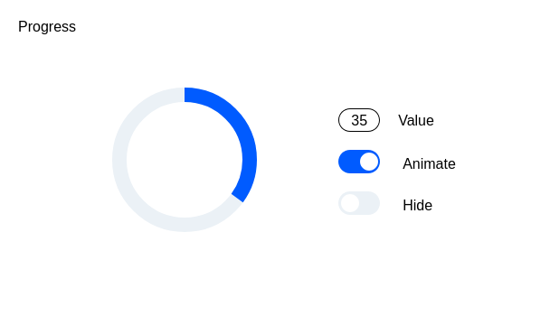

# Circular progress bar

## Описание

Проект представляет собой адаптивный круговой прогресс-бар с возможностью управления через интерфейс: значением <value>, анимацией вращения <animated> и скрытием/показом элемента <hidden>. Прогресс-бар реализован в виде веб-компонента <circular-progress>, который поддерживает передачу атрибутов через HTML или JavaScript.

Проект доступен по ссылке: https://emberfrog.github.io/



## Функциональность

1. Управление значением `value` :

   - Пользователь может устанавливать значение прогресса от 0 до 100 через атрибут value или внешний интерфейс ввода Value.

2. Анимация вращения `animated` :

   - Атрибут animated позволяет включать/выключать плавную анимацию вращения индикатора. Передается в атрибуты или через переключатель Animate.

3. Скрытие элемента `hidden` :

   - Атрибут hidden делает прогресс-бар невидимым без изменения верстки страницы. Передается в атрибуты или через переключатель Hide.

4. Адаптивность :

   - Блок автоматически меняет свои размеры в зависимости от устройства:
   - На мобильных: 320x568.
   - На десктопах: 568x320.

## Использованные технологии

1. HTML :

   - Создание разметки для компонента и интерфейса управления.

2. CSS :

   - Стили для внешнего вида компонента.
   - Анимация вращения с использованием @keyframes.
   - Адаптивная верстка с помощью медиа-запросов.

3. JavaScript :

   - Реализация веб-компонента с использованием класса HTMLElement.
   - Обработка атрибутов (value, animated, hidden) через метод attributeChangedCallback.
   - Динамическое обновление прогресса и состояния анимации.

4. Web Components :

   - Компонент зарегистрирован через customElements.define.

## Требования

- Современный браузер, поддерживающий Web Components (например, Chrome, Firefox, Edge).
- Поддержка CSS Grid/Flexbox для адаптивного макета.

## Запуск проекта

1. Склонируйте репозиторий:

   ```
   git clone <URL_вашего_репозитория>
   ```

2. Откройте файл index.html в любом современном браузере.

## Особенности работы

1. Если пользователь вводит недопустимое значение в `input`, оно автоматически корректируется в диапазоне 0–100.

2. При переключении атрибута hidden, элемент становится невидимым, но сохраняет свое место в верстке.

## Контакты

Если у вас есть вопросы или предложения по улучшению кода, свяжитесь со мной:

Email: nikitapolianskii.wk@gmail.com

GitHub: https://github.com/emberFrog
